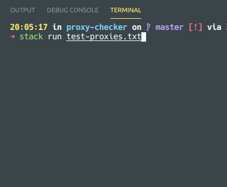

# Proxy Checker

Check the status of public proxies to make sure they're working properly.

Results can be extremely inconsistent from use to use as public proxies are often very unreliable to begin with.

## Usage

`stack run test-proxies.txt`

The first argument is any file that has proxies in the format of `ip:port`

> This was made more for the purpose of learning concurrency in haskell

